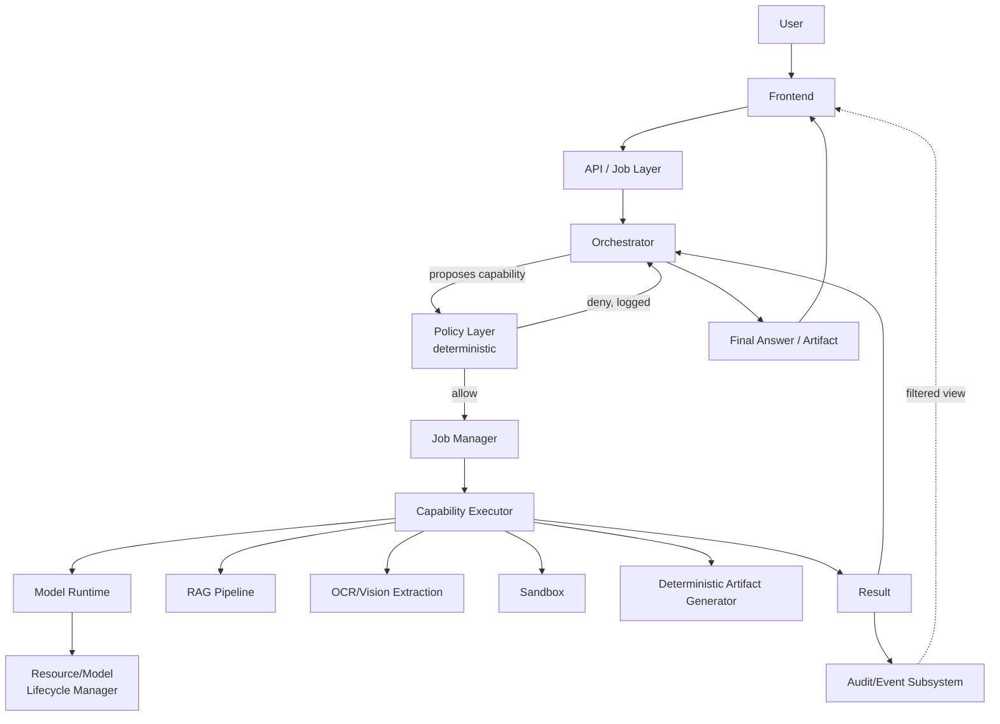

# Architecture

## Purpose

A sovereign agentic AI workbench where an Orchestrator reasons about a request, proposes capability invocations, and every invocation passes through a deterministic Policy gate before anything executes — all recorded in a single Audit event stream that also drives the live UI trace. See `project-context.md` for the one-paragraph summary; this document is the detailed reference.

## Architectural principles (locked, Phase 1)

- The Orchestrator reasons; it has no execution rights.
- Capabilities are explicit and declared, not inferred from free text.
- Policy is fully deterministic and sits between every proposal and its execution — no bypass path exists.
- Executors perform only approved actions.
- Models are resolved through resource types, never referenced by name in application logic.
- The Model Runtime is abstracted from the rest of the application.
- The Resource/Model Lifecycle Manager owns loading, unloading, and memory contention.
- RAG retrieval is always explicit — never automatically invoked.
- OCR is one capability with internal tiered escalation — not agent-visible sub-steps.
- The sandbox is isolated and network-denied, identically on macOS and Windows.
- Artifact generation is deterministic — models produce data, code produces files.
- Jobs are first-class execution objects.
- The Job trace is a filtered view over the Audit/Event stream — never a second log.
- Zero-egress is enforced in layers.
- The system operates fully locally/offline after provisioning.
- Model choices are configuration, resolved through the Resource/Model Configuration Registry.

## Component architecture

## Responsibilities and boundaries

| Component | Responsible for | NOT responsible for |
|---|---|---|
| Frontend | UI, uploads, live trace display, artifact download | Talking to models, tools, or Docker directly |
| API/Job Layer | Creating and tracking Jobs | Reasoning, execution |
| Orchestrator | Reasoning, proposing capabilities, consuming results, final answer | Execution of any kind |
| Policy Layer | Allow/deny every proposed capability invocation | Reasoning about what *should* be done |
| Job Manager | Job/step state, dispatch to Executors | Policy decisions |
| Capability Executors | Doing the actual work (deterministic or model-backed) | Deciding whether they're allowed to run |
| Model Runtime | Resolving a resource type to a live model instance | Knowing why a capability needs it |
| Resource/Model Lifecycle Manager | Load/keep-alive/unload/eviction | Reasoning, policy |
| RAG Pipeline | Ingestion, retrieval | Deciding when retrieval is needed (Orchestrator decides) |
| Sandbox | Isolated code execution | Anything outside a single execution's scope |
| Deterministic Artifact Generator | Rendering DOCX/XLSX from structured data | Composing the content itself |
| Audit/Event Subsystem | Recording everything | Making decisions |

## Request lifecycle

1. Request arrives (text + optional files) → API/Job Layer creates a **Job** (`status: created`), fires `job_created` audit event.
2. Orchestrator reads Job context (conversation + any explicitly retrieved context) → answers directly, or proposes a capability by name with arguments.
3. Policy Layer evaluates deterministically → `allow` or `deny`, both logged as `policy_decision` events. A `deny` is returned to the Orchestrator as a failed step it can react to but not override.
4. If allowed: Job Manager creates a JobStep, dispatches to the relevant Capability Executor.
5. Executor performs the work — possibly resolving a resource type via Model Runtime → Lifecycle Manager, possibly pure deterministic code — records resource usage on the JobStep, fires `tool_invoked`/`model_invoked` events as relevant.
6. Result recorded on the Job, `artifact_created`/`error` events fired as relevant, streamed to the frontend (SSE, scoped to `job_id`), returned to the Orchestrator as new context.
7. Loop continues (steps 2–6) until: final answer reached, step limit hit (default 8 — see `agent.md`), or unrecoverable error.
8. Job marked `completed` or `failed`, `job_completed` event fired, artifacts linked, full trace available live and retroactively.

## Job lifecycle

`created` → `running` → (`completed` | `failed`). See `data-model.md` for the full Job/JobStep schema.

## Capability lifecycle

Declared in the Capability Registry (`capabilities.md`) → proposed by the Orchestrator → evaluated by Policy → dispatched by the Job Manager → executed by an Executor → result recorded. A capability's resource-type requirement, permission requirements, and input/output contract are fixed at declaration time, not decided per-invocation.

## Model/resource lifecycle

See `models.md` for full detail. Summary: a capability requests a resource type → Model Runtime resolves it via the Resource/Model Configuration Registry → Lifecycle Manager either serves an already-loaded instance or loads it, evicting the least-recently-used non-reasoning resource under memory pressure. Load/unload/eviction are themselves audited events.

## Security boundaries

See `security.md` for full detail. In architectural terms: Orchestrator (proposes) → Policy (permits) → Executor (does) are three distinct roles that are never collapsed. The Sandbox is a capability boundary reachable only through its Executor. Zero-egress is layered, not a single control.

## Zero-egress architecture

Application layer (no external-call code paths exist) → Capability layer (`network_access: false` by default on every capability) → Model Runtime layer (local-only resolution) → Sandbox layer (`--network none`) → Deployment/OS layer (firewall rule scoping the backend process to loopback) → Monitoring layer (live connection monitor + `network_check` audit events, standing and independent of any single Job).

## Cross-platform architecture

The application architecture — Orchestrator, Policy, Job Manager, Executors, API — is identical regardless of OS. The Sandbox Capability contract (`sandbox.md`) is implemented once, using Docker, and is invoked identically on macOS and Windows; there is no OS-specific branch in application logic. The Model Runtime (Ollama) also runs identically across platforms, with backend selection (Metal vs. CUDA) handled transparently by Ollama itself.

## Artifact flow

Orchestrator produces structured data (never formatted output) → proposes an artifact-generation capability → Policy approves → Deterministic Artifact Generator renders the file using a fixed template → file stored under `data/artifacts/`, referenced by the Job and by an `Artifact` row in the database → available to the frontend for preview/download.

## Failure boundaries

| Failure | Handling |
|---|---|
| Policy denial | Returned to Orchestrator as a failed JobStep; Orchestrator may explain but not override |
| Malformed capability proposal | Rejected before Policy evaluation; JobStep marked failed, Orchestrator sees the rejection reason |
| Model load failure | JobStep failed, `error` event fired, Orchestrator informed, does not crash the Job |
| Executor error (e.g., sandbox crash, extraction failure) | Captured, recorded, returned to Orchestrator as a tool result it can react to |
| Step-limit reached | Job marked `failed` with reason `step_limit_exceeded`, partial results retained |

## Observability

Everything of interest is an Audit event (see `audit.md` for the full event-type list). The frontend's live trace, the sovereignty proof panel, and any later debugging all read from this one stream — there is no second logging system to keep in sync.

## Tradeoffs (explicit, from Phase 1/2 discussion)

| Choice | What we gained | What we gave up |
|---|---|---|
| Hand-rolled agent loop over a framework | Full control, auditable, no unaudited dependency for the zero-egress story | More of our own build time |
| Docker everywhere, not Apple `container` | One implementation, one onboarding path, team consistency | Stronger per-execution VM isolation, lower idle memory (Apple `container`'s advantages) |
| Rule-based/deterministic Policy | Predictable, explainable, impossible to argue with live | No adaptive/context-sensitive policy behavior |
| SQLite over Postgres | Zero-ops, matches single-workstation deployment | No real multi-user concurrency (not needed for SIH) |
| Chroma over FAISS/LanceDB | Embedded, simple, fast to build against | Less headroom at very large corpus scale (not relevant at demo scale) |

## Architectural decisions

See `decisions.md` for the full ADR set.
